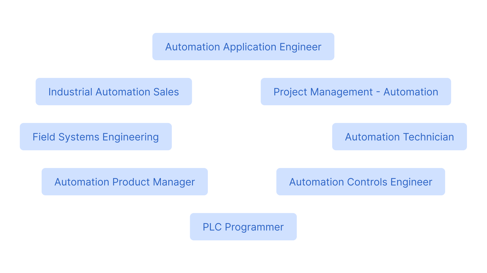

# Профессии в автоматике


В данной статье я расскажу о разнообразии профессией в области автоматизации. Эта статья прежде всего для тех, кто хочет узнать чем же занимаются инженеры по автоматизации, с какой ступени нужно начать и какие знания и навыки необходимы для этого.&#x20;


### Здесь только автоматики?

Область автоматизации и автоматики в целом не ограничиваются одной профессией под названием автоматик. Это обширное направление, где имеются специализации общего назначения так и узконаправленные специализации. В этой статье я приведу примеры должностей в области автоматизации и расскажу о них пару слов: какие знания необходимы и что они в целом делают


Что такое автоматизация можно посмотреть в предыдущем разделе [Об автоматизации](./)


&#x20;Автоматизацию изучают на уровне профессионального образования и на уровне университета. На уровне профессионального образования вы узнаете основные моменты, которые затрагивают автоматику (дигитальная техника, электричество, электроника, программирование контроллеров и т.д.), а на уровне выше, т.е. в университетах вы будете изучать эту тему уже более углубленно и фундаментально.

<figure><figcaption>
Небольшой список профессий в области автоматизации
</figcaption></figure>


Здесь указаны основные и самые распространенные должности по статистике и спискам Linkedin/jobs. Эти должности могут отличаться от ваших названиями и обязанностями (необязательно, что ваши обязанности будут именно такими)


## Первая ступень

Самая первая ступень на карьерной лестнице в области автоматики это стать конечно самим автоматиком, или же **Automation Technician** (техник по автоматизации)

### **Automation Technician**&#x20;

можно стать практически сразу после выпуска из профессионального училища или университета.&#x20;

Основные задачи:&#x20;

* **Рутинная диагностика**  - проверка оборудования, линии, отдельных элементов систем и составление отчетов.&#x20;
* **Работа с электропроводкой -** проводка кабелей, сборка щитов и другая электромонтажная работа по документации и схемам
* **Ремонт и обслуживание** - необходимо уметь находить неисправности в оборудовании и проводить техническое плановое и неплановое обслуживание
* **Сантехника (mechanical plumbing)** - если мы говорим об автоматизации производств то нужно будет уметь прокладывать трубы, подсоединять туда различные датчики и другое оборудование.

**Из знаний здесь необходимы:** основное понимание о том, как работает электричество. Понимание о том, как работают различные датчики и другие исполнительные механизмы и немного практических знаний в PLC программировании.

### PLC programmer

Должность разработчика ПО для контроллеров я бы отнес к отдельной ветке, так как для того чтобы программировать контроллеры не нужно прям очень глубокое понимание автоматизации, здесь скорее необходимы знания ИТ и программирования.

Основные задачи:

* Программирование контроллеров
* Проектирование программного обеспечения для систем управления
  * Electircal and controls design (разработка систем управления)
  * Process controls network (разработка сетей управления)
  * Database design (разработка архитектуры баз данных, сюда же можно отнести SQL скриптинг)

**Из знаний здесь необходимы:** продвинутый уровень программирования промышленных контроллеров, знания ООП, знания о том как работают промышленные сети. Начальный/продвинутый уровень в база данных (начиная от составления простых запросов)

## Вторая ступень

Здесь вы уже являетесь более опытным в плане практики и теоретически подкованным специалистом в области автоматизации. Вы уже можете не только работать по готовой документации, чертежам и схемам но и вполне можете сами их составлять и проектировать системы

### Field system engineer

Специалист, который в основном работает на объектах. Руководит рабочим процессом и проверяет работу других автоматиков (тех же automation technician).

Основные задачи:

* Обеспечивать техническое руководство на объектах
* Вносить изменения в существующий проект и в документацию
* Полная наладка и установка оборудования и систем
* Инспекция и ввод в эксплуатацию технического оборудования

**Из знаний здесь необходимы:** понимание о том как работают АСУТП (автоматических систем управления технологическими процессами), продвинутый уровень в наладке оборудования и промышленных систем. Навыки прораба (раздавать и проверять работу команде)

### Automation application & Automation controls engineer (проще говоря automation engineer)

Опытный специалист в области автоматизации, способный создавать собственные решения для АСУТП (автоматические системы управления технологическим процессом). Большую часть времени вы будете проводить в офисе и меньшую часть на объектах

Основные задачи:

* Проектирование АСУТП
* Симуляция АСУТП и отдельных процессов
* Программирование (PLC programmer)
* Введение в эксплуатацию систем

## Третья ступень

Данная ступень является скорее бизнес ступенью, где инженеры занимаются бизнес делами компании. Они являются менеджерами по различным продуктам и проектам, руководят отделами и производствами.

### Industrial automation sales engineer

Данный специалист является своего рода 1 в 3 инженером. Он является и automation technician, и field system engineer, и automation engineer.

Основные задачи:

* Находить и предлагать эффективные решения под потребности клиента
* Составлять ценовые предложения и находить общий язык с клиентами&#x20;
* Сопровождать клиента от начала разработки проекта до его конечного результата (ввод в эксплуатацию)
* Помогать клиенту с выбором и подбирать наилучшие решения в области автоматизации

### Automation product manager & project management - automation

Это в основном менеджеры продуктов, проектов и руководители отделов. Их прямой и самой основной обязанностью является руководство в своем отделе. Они занимаются переговорами с клиентом. Составляют планы, обсуждают их с другими инженерами. Следят за работой в своем отделе, проверяют работу своих инженеров. Делают отчеты для начальства.&#x20;

## Другие должности

Помимо вышеперечисленных должностей существуют еще следующие частовстречающиеся должности:

* Service engineer - сервисный инженер, который занимается в основном ремонтом и диагностикой систем и оборудования
* Lead automation engineer - ведущий систем по автоматизации, который может заниматься более серьезными и трудоемкими задачами, так и следить за младшими инженерами и наставлять их. В основном они руководят другими инженерами.
* Operations automation engineer - что-то среднее между менеджером проектов по автоматизации и ведущего инженера в отделе
