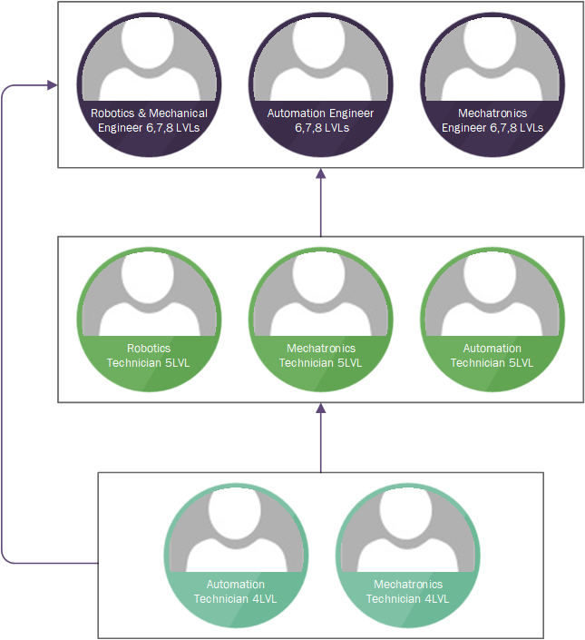

# Где учиться? (На примере Эстонии)

В этой статье мы рассмотрим где в Эстонии есть возможность обучаться и развиваться в области автоматизации и смежным к ней другим областям.&#x20;

## Европейская система квалификаций


В Эстонии как и во всей Европе действует система уровней квалификаций. Эта система называется **European Qualifications Framework (EQF)**. Подробнее про нее можно прочитать здесь: [https://europa.eu/europass/en/description-eight-eqf-levels](https://europa.eu/europass/en/description-eight-eqf-levels)


В Эстонии можно посмотреть как работает эта система через Kutseregister (регистр профессиональных квалификаций): [https://www.kutseregister.ee/](https://www.kutseregister.ee/). Здесь же можно посмотреть на свои квалификации, которые были зарегистрированы в Эстонии. Если у вас образование и квалификация получена в другом европейском государстве, то необходимо здесь в Эстонии, через HM.ee, подтвердить свое образование и квалификацию для занесения в регистр.&#x20;

## Разделение на уровни в Эстонии

У нас точно так же идет разделение на уровне. Принято считать, что самый начальный уровень в професии автоматика считается 4. То есть среднее специальное образование, которое можно получить после 9 класса.&#x20;

Уровень 5 считается уровнем специалиста в конкретной области. Для того, чтобы получить 5 уровень необходимо иметь квалификацию 4 уровня, а так же в большинстве случаев опыт работы в конкретной области. Учеба на 5 уровне обычно занимает от 6 месяцев до 2 лет, в зависимости от учебного заведения и от учебной программы.

<figure><figcaption>
Рисовал сам, не судите строго :)
</figcaption></figure>
