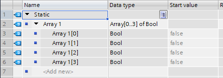

# S7-1200

### Принцип работы ПЛК Siemens SIMATIC S7-1200 

У контроллера S7-1200 есть 3 режима работы CPU (центральный процессор контроллера):

* **STOP**
* **STARTUP**
* **RUN**


**CPU** выполняет следующие задачи: 1) записывает выходы из области выходов образа процесса в физические выходы 2) считывает физические входы непосредственно перед исполнением программы пользователя и сохраняет значения входов в области входов образа процесса 3) выполняет логику команд пользователя и обновляет значения выходов в области выходов образа процесса


В режиме **STOP** CPU не выполняет программу и позволяет загружать проект из TIA portal.&#x20;

В режиме **STARTUP** один раз выполняются OB (организационный блок) запуска (если такие имеются). События, связанные с прерываниями, на этапе запуска режима **RUN** не обрабатываются.&#x20;

В режиме **RUN** многократно выполняется цикл сканирования. События, связанные с прерываниями, могут возникнуть и быть обработаны в любых точках внутри программного цикла. В режиме **RUN** нет возможности загрузить проект из TIA portal.&#x20;

### Переход из режима STOP в режим RUN 

<figure><figcaption></figcaption></figure>

Во время перехода из режима **STOP** в режим **RUN** контроллер проходит дополнительное через режим **STARTUP**.&#x20;

Режим **STARTUP**:

**A:** Очищается область памяти входов (I)

**B:** Выходы инициализируются последним или заменяющим значением

**C:** Исполняются организационные блоки (OB) запуска

**D:** Состояние физических входов копируется в область памяти входов (I)

**E:** Все события, связанные с прерываниями, сохраняются в очереди ожидания для обработки в режиме RUN

**F:** Активируется запись области памяти выходов (Q) в физические выходы


Специальные организационные блоки (OB), которые запускаются единожды во время режима STARTUP в TIA portal называются **Startup interrupt**. В такие блоки можно поместить часть пользовательской программы, например перед основным циклом программы сбросить данные.


Режим RUN:

**1:** Область памяти Q записывается в физические выходы

**2:** Состояние физических входов копируется в область памяти I

**3:** Исполняются OB программного цикла

**4:** Выполняется самодиагностика

**5:** Во всех частях цикла обрабатываются прерывания и коммуникации


У контроллеров S7 существуют так называемые "блоки прерываний". Это особые блоки выполняются только при определенных условиях (например: раз за определенный промежуток времени, во время физического сигнала на один из входов на контроллер и т.д.).


### Программные блоки S7-1200

Всего у контроллеров S7 имеется 4 основных программных блока:

**OB** (organization block) - организационный блок

**FB** (function block) - функциональный блок

**FC** (function) - блок функции

**DB** (data block) - блок данных

<figure><figcaption></figcaption></figure>

Теперь немного подробнее про каждый блок:

#### Организационные блоки (OB) 

Организационные блоки (OB) служат для структурирования вашей программы, они образуют связь между операционной системой контроллера и программой пользователя. OB блоки управляются событиями, например интервал времени или диагностическое прерывание.&#x20;

OB программного цикла содержит главную программу пользователя. Можно использовать в своей программе более одного организационного блока. После обработки OB программного цикла CPU контроллера начинает немедленно исполнять этот OB снова. Такая циклическая обработка является нормальным видом обработки для программируемых логических контроллеров. Вся пользовательская программа может находится в одном OB.&#x20;

#### Функциональный блок (FB) 

Функциональный блок (FB) - это программный блок, который использует шаблон блока данных для своих параметров и статических данных. FB имеют переменную память, которая может находится в блоке данных (DB) или в шаблоне DB. Шаблонный DB представляет собою блок памяти, связанный с FB, и хранит данные после исполнения FB.&#x20;

#### Блок функций (FC) 

Блок функций или просто функция (FC) - это программный блок, который обычно выполняет определенную операцию с набором входных значений. FC сохраняет результаты этой операции в определенных местах памяти. FC может вызываться несколько раз в различных местах программы. Это повторное использование упрощает программирование часто повторяющихся задач. В сравнении с FB у FC нет связанного с ним шаблона блока данных DB. FC использует стек локальных данных для временных данных. Временные данные не сохраняются. Для длительного хранения данных выходная величина должна быть присвоена адресу в памяти.

#### Блок данных (DB) 

В своей пользовательской программе можно создавать блоки данных (DB) для сохранения данных для других блоков. Все программные блоки в программе пользователя могут обращаться к данным в глобальном DB, однако шаблонные FB хранят данные для конкретного функционального блока FB. DB можно использовать режим "чтение-запись" или только "чтение" данных.

### Использование блоков для структурирования программы 

Модульные программные блоки вы создаете путем разработки функциональных блоков и функций для выполнения задач. Вы структурируете свою задачу, вызывая повторно используемые программные блоки из других программных блоков. Вызывающие блоки передают параметры конкретного устройства в вызываемый блок.

<figure><figcaption></figcaption></figure>

**A**: Вызывающий блок

**В**: Вызываемые (или прерывающий) блок

**1**: Исполнение программы

**2**: Операция, которая вызывает другой блок

**3**: Исполнение программы

**4**: Конец блока (возврат в вызывающий блок)

Если программный блок вызывается другим программным блоком, CPU исполняет программный код в вызванном блоке. После того как вызванный блок обработан, CPU возобновляет исполнение вызывающего блока.

<figure><figcaption></figcaption></figure>

**1:** Начало цикла

**2:** Глубина вложения

Обработка продолжается исполнением команды, следующей за вызовом блока. Вызовы блоков могут быть вложены друг в друга, делая структуру еще более модульной

### Типы данных 

Типы данных используются для указания размера элемента данных, а также того, как эти данные могут быть интерпретированы. Каждый параметр команды поддерживает, по крайней мере, один тип данных, а некоторые параметры поддерживают несколько типов данных.

**Формальный параметр** – это идентификатор на команде, который указывает адрес данных, подлежащих использованию командой (пример: вход IN блока CTU).&#x20;

**Фактический параметр** – это адрес или константа, где содержатся данные, подлежащие использованию командой (пример: %M0.0 "Pushed\_button\_memory"). Тип данных фактического параметра, указанный вами, должен соответствовать одному из поддерживаемых типов данных формального параметра

| Тип данных                            | Размер (бит)                     | Диапазон                                                                                                                                   | Пример                                  |
| ------------------------------------- | -------------------------------- | ------------------------------------------------------------------------------------------------------------------------------------------ | --------------------------------------- |
| **Bool** (булево выражение)           | 1                                | от 0 до 1                                                                                                                                  | TRUE, FALSE, 1, 0                       |
| **Byte** (байт)                       | 8                                | 
<strong>10-ричная система:</strong> от 0 до 255

<strong>16-ричная система:</strong> от 16#00 до 16#FF
                         | 100, 16#AB                              |
| **Word** (слово)                      | 16                               | 
<strong>10-ричная система:</strong> от 0 до 65535 <strong>16-ричная система:</strong> 16#0000 до 16#FFFF
                         | 60100, 16#ABCD                          |
| **DWord** (двойное слово)             | 32                               | 
<strong>10-ричная система:</strong> от 0 до 4294967295 <strong>16-ричная система:</strong> от 16#00000000 до 16#FFFFFFFF
         | 120000, DW#16#00A2\_1234                |
| **Char** (символ)                     | 8                                | от 16#00 до 16#FF или "1", "A", "&"                                                                                                        | "F"                                     |
| **SInt** (число)                      | 8                                | от -128 до 127                                                                                                                             | 123, -123                               |
| **Int** (число)                       | 16                               | от -32768 до 32767                                                                                                                         | 123, -123                               |
| **DInt** (число)                      | 32                               | от -2147483648 до 2147483647                                                                                                               | 123, -123                               |
| **USint** (число)                     | 8                                | от 0 до 255                                                                                                                                | 123                                     |
| **UInt** (число)                      | 16                               | от 0 до 65535                                                                                                                              | 123                                     |
| **UDInt** (число)                     | 32                               | от 0 до 4294967295                                                                                                                         | 123                                     |
| **Real** (число с точностью)          | 32                               | от +/-1,18 x10^-38 до +/-3,40 x10^38                                                                                                       | 123.456, -3.4, -1.2E+12, 3.4E-3         |
| **LReal** (число с двойной точностью) | 64                               | от +/-2,23 x10^-308 до +/-1,79 x10^308                                                                                                     | 12345.123456789 -1.2E+40                |
| **Time** (время)                      | 32                               | 
от T#-24d_20h_31m_23s_648ms до T#24d_20h_31m_23s_647ms  <strong>Хранится как:</strong> от -2,147,483,648 мс до +2,147,483,647 мс
 | 
T#5m_30s T#1d_2h_15m_30x_45ms
 |
| **String** (строка)                   | Переменный (зависит от значения) | от 0 до 254 символов в размере байта                                                                                                       | 'This is my string'                     |

#### Формат для вещественных чисел (Real, LReal) 

Числа с плавающей точкой представляются как 32-битовые числа с обычной точностью (Real) или 64-битовые числа с двойной точностью (LReal) в соответствии с описанием в стандарте ANSI/IEEE 754-1985. Числа с плавающей точкой обычной точности имеют точность до 6 значащих цифр, а числа с плавающей точкой двойной точности имеют точность до 15 значащих цифр. При вводе константы с плавающей точкой вы можете задать не более 6 (Real) или 15 (LReal) значащих цифр.

#### Массивные типы данных 

Контроллер и TIA portal позволяют создавать массивы, содержащие несколько элементов одного элементарного типа. Массивы могут создаваться в блоках OB, FC, FB, DB. Массив невозможно создать в редакторе переменных ПЛК (таблица тегов)

Для создания массива в редакторе интерфейса блока выберите тип данных "Array \[lo.. hi] of type", затем отредактируйте "lo", "hi" и "type" следующим образом:

**lo** - начальный (наименьший) индекс для вашего массива

**hi** - конечный (наибольший) индекс для вашего массива

**type** – один из элементарных типов данных, например, BOOL, SINT, UDINT

Отрицательные индексы тоже поддерживаются. Вы можете дать имя массиву в столбце Name редактора интерфейса блока. В следующей таблице показаны примеры массивов в том виде, как они отображаются в редакторе интерфейса блоков:

| Имя массива | Тип данных           | Комментарий                                 |
| ----------- | -------------------- | ------------------------------------------- |
| Array 1     | Array\[0..3] of Bool | Массив, который содержит 4 булевых значений |

<figure><figcaption></figcaption></figure>

К элементам массива вы обращаетесь в своей программе, используя следующий синтаксис:

Array\_name\[i], где i - желаемый индекс. Здесь уточняется к какому элементу массива идет обращение

Например: Array 1\[3] - ссылаемся на третий бит массива Array 1

