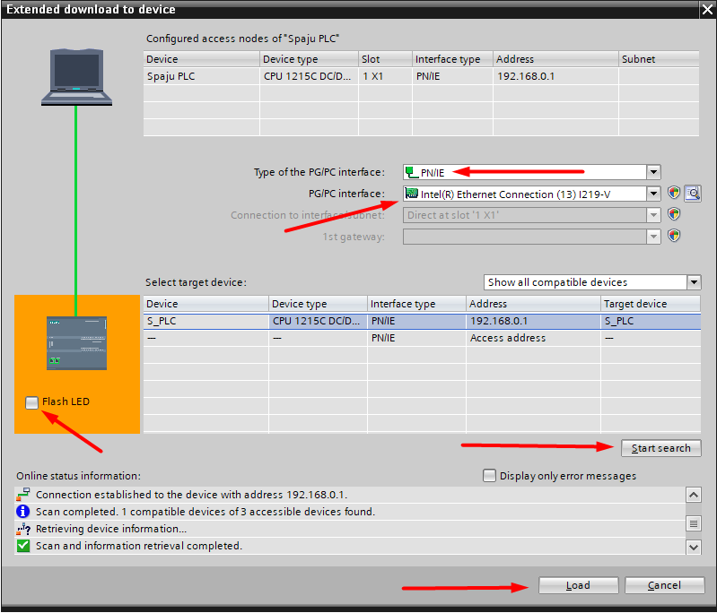

# Начало

### Создание нового проекта 

После запуска TIA portal вы увидите окно со всеми своими проектами и кнопкой **open** можете открыть любой их них. Если вы запустили первый раз, то слева увидите колонку с кнопкой **Create new project**.

<figure><figcaption></figcaption></figure>

После кнопки создания проекта необходимо заполнить первичную информацию о вашем проекте.&#x20;

**Project name** - имя вашего проекта. Старайтесь не давать длинные имена проектам

**Path** - путь, где проект будет сохранен (поддерживается возможность сохранять с помощью компьютера на onedrive или на удаленный диск, указав путь).

**Version** - версия TIA portal. Если на вашем компьютере имеется несколько версий TIA (v13, V15, V17 и т.д.) то здесь вы можете выбрать с помощью какого именно портала вы хотите создать проект. Не рекомендуется использовать старые версии.

**Author** - имя автора. По умолчанию будет заполняться именем пользователя компьютера.

**Comment** - комментарий к проекту. В project name можно указать короткое название проекта, а в комментарии развернуто описать ваш проект.

<figure><figcaption></figcaption></figure>

После того как все необходимые поля заполнены нажимаем на кнопку **create** и даем время tia portal чтобы он создал необходимые файлы для проекта и подготовил рабочее пространство.

### Добавление устройства (контроллера) 

После того как проект создан необходимо добавить новое устройства, то есть наш контроллер.&#x20;

<figure><figcaption></figcaption></figure>

После смотрим в левую сторону и находим кнопку **Add new device** и нажимаем на неё.

**Далее:** у вас откроется окно с выбором устройств, которые вы ходите добавить.&#x20;

1. Переходим во вкладку Controllers (контроллеры)
2. Необходимо найти ваш контроллер, с которым вы будете работать. В моем случае это SIMATIC S7-1200 с процессором CPU 1215C DC/DC/DC и с идентификатором 6ES7 215-1AG40-0XB0. Такую информацию можно найти на корпусе вашего контроллера.&#x20;


Если у вас нет еще контроллера и вы хотите в будущем использовать симулятор PLCSIM, то советую в заранее позаботиться о том, какой именно контроллер вы будете использовать. Потому что в зависимости от типа контроллера меняется функционал и возможности tia portal.&#x20;


3. В **Device name** вы можете указать имя, которое будет присвоено вашему контроллеру. Обратите внимание, что знак "\_" не является обязательным.&#x20;
4. В **Version** (в моем случае V4.5) вы выбираете прошивку контроллера с которым вы будете работать. Советую всегда использовать максимальную версию прошивки.&#x20;


Может такое произойти, что в TIA portal для вашего контроллера доступна максимальная версия прошивки (например V4.5), а сам контроллер с прошивкой V4.4. В таком случае при выборе прошивки V4.5 вы не сможете загрузить вашу программу в контроллер (будет ошибка, о том что firmware различается).


5. После того, как мы разобрались со всем нажимаем на кнопку **Add,** после чего TIA portal откроет вам окно с вашим выбранным контроллером.

<figure><figcaption></figcaption></figure>

### Проверка контроллера (online, software) 


Только если у вас имеется физический доступ к контроллеру!


Проверить правильно ли бы выбран контроллер и все ли работает корректно можно с помощью простой программы:

1. Переходим в папку Program block и выбираем главный по умолчанию блок Main \[OB1]
2. С помощью языка LAD создаем простую схему (включить выход Q0.0 по сигналу на контроллер через I0.0)
3. Сверху находим и нажимаем на **Download to device**

<figure><figcaption></figcaption></figure>

Далее: здесь необходимо найти наш контроллер в сети. Обратите внимание, что контроллер должен быть либо: a) физически подсоединен к компьютеру через Ethernet кабель б) должен находится в одной сети с вашим компьютером

1. В Type of the PG/PC interface выбираем тип интерфейса (если Ethernet кабель, то PN/IE)
2. В PG/PC interface выбираем сетевой адаптер, к которому подключен наш контроллер&#x20;
3. Нажимаем на кнопку **Start search**. Если выше все сделано и выбрано правильно, то в списке ниже вы увидите ваш контроллер
4. Нажав на Flash LED вы сможете убедиться, что вы обращаетесь именно к вашему контроллеру (на контроллере физически начнут мигать LED индикаторы)
5. В списке устройств выбираете ваш контроллер и нажимаете на **Load**

<figure><figcaption></figcaption></figure>

Далее будет несколько окон, где нужно будет подтвердить:

1. Что мы доверяем контроллеру (если он стоит без пароля)
2. Что мы хотим загрузить программу без синхронизации
3. Что мы хотим остановить работу контроллера перед загрузкой (Stop)
4. Что мы хотим включить контроллер после загрузки программы (Start)


В некоторые моменты (особенно в первые разы) TIA portal может попросить вас согласиться добавить новый IP адрес для контроллера. С этим нужно будет согласиться и тогда адрес контроллера будет обновлен в сетевом адаптере


<figure><figcaption></figcaption></figure>

 

<figure><figcaption></figcaption></figure>

 

<figure><figcaption></figcaption></figure>

 

<figure><figcaption></figcaption></figure>

После того как вы загрузили программу обязательно проверьте будет ли она работать.&#x20;
