# Программирование

## Принцип программирования контроллеров S7-1200

### Языки программирования <a href="#about-plc-programming" id="about-plc-programming"></a>

На момент 17 версии TIA portal поддерживает следующие языки программирования для контроллеров S7-1200:

**LAD** (Ladder diagram):

<figure>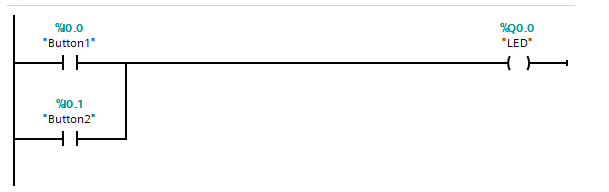<figcaption></figcaption></figure>

**FBD** (Functional block diagram):

<figure>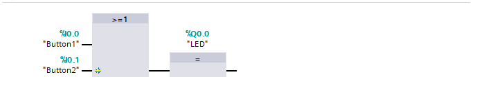<figcaption></figcaption></figure>

**SCL** (Structured control language):IF "Button1" AND "Button2" THEN

```cpp
IF "Button1" AND "Button2" THEN
    "LED" := 1;
ELSE
    "LED" := 0;
END_IF;
```

**CEM** (Cause Effect Matrix)

<figure>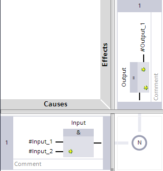<figcaption></figcaption></figure>

### Логические операции

Все логические операции в контроллере используют таблицу истинности и логические элементы: И, ИЛИ, ИЛИ-НЕ, И-НЕ. В логических операциях используются только битовые значения: 0 или 1.&#x20;

В языке LAD существуют NO, NC контакты, которые можно комбинировать чтобы реализовывать различную логику в программе.

#### Логическая операция И

| ВХОД 1 | ВХОД 2 | РЕЗУЛЬТАТ |
| ------ | ------ | --------- |
| **1**  | **1**  | **1**     |
| 0      | 1      | 0         |
| 1      | 0      | 0         |
| 0      | 0      | 0         |

Реализация на языке LAD:

<figure>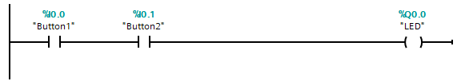<figcaption></figcaption></figure>

Реализация на языке SCL:

```cpp
IF "Button1" AND "Button2" THEN 
    "LED" := 1; 
ELSE 
    "LED" := 0; 
END_IF;

//Второй способ
"LED" := "Button1" AND "Button2"
```

#### Логическая операция ИЛИ

| ВХОД 1 | ВХОД 2 | РЕЗУЛЬТАТ |
| ------ | ------ | --------- |
| 1      | 1      | 1         |
| 0      | 1      | 1         |
| 1      | 0      | 1         |
| 0      | 0      | 0         |

Реализация на языке LAD:

<figure>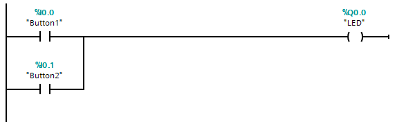<figcaption></figcaption></figure>

Реализация на языке SCL

```cpp
IF "Button1" OR "Button2" THEN
    "LED" := 1;
ELSE
    "LED" := 0;
END_IF;

//Второй способ
"LED" := "Button1" OR "Button2"
```

#### **Логическая операция "Исключающее ИЛИ"**

| ВХОД 1 | ВХОД 2 | РЕЗУЛЬТАТ |
| ------ | ------ | --------- |
| 1      | 1      | 0         |
| 1      | 0      | 1         |
| 0      | 1      | 1         |
| 0      | 0      | 0         |

Реализация на языке LAD

<figure>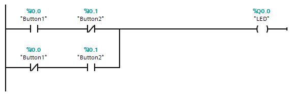<figcaption></figcaption></figure>

Реализация на языке SCL

```cpp
IF ("Button1" AND NOT "Button2") OR (NOT "Button1" AND "Button2") THEN
    "LED" := 1;
ELSE
    "LED" := 0;
END_IF;

//Второй способ
"LED" := ("Button1" AND NOT "Button2") OR (NOT "Button1" AND "Button2");
```

#### Инвертирование сигнала


<figure>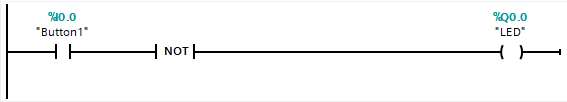<figcaption></figcaption></figure>

```cpp
"LED" := NOT "Button1";
```

### Работа с памятью контроллера

У контроллера S7-1200 имеются различные виды памяти:&#x20;

M% / Q% - бит (0 или 1)

MB% - 8 бит

MW% - 16 бит

MD% - 32 бита

**Логика работы и обращение к памяти по адресу**

Битовая память (**M - memory**) имеет адрес M0.0, где первая цифра - это номер **байта**, а вторая - это номер **бита в байте**.&#x20;

> Обращаю внимание, что в ИТ счёт начинается с 0 (то есть 0 это для нас 1)


Возьмем для примера 2 битовой памяти с адресами: M0.2 и M3.1

**M0.2** - это 3 бит памяти в 1 байте

**M3.1** - это 2 бит памяти в 4 байте



Следующий тип памяти - это байтовая память (**MB - memory byte**), которая вмещает в себя 8 бит (M). После байтовой памяти идет память слово (**MW - memory word**), которая вмещает в себя 16 бит (M) или просто 2 байта (MB). Последним типом памяти является память двойного слова (**MD - memory double**), которая вмещает в себя 32 бита (M), или 4 байте (MB), или 2 памяти слова (MW)

<figure>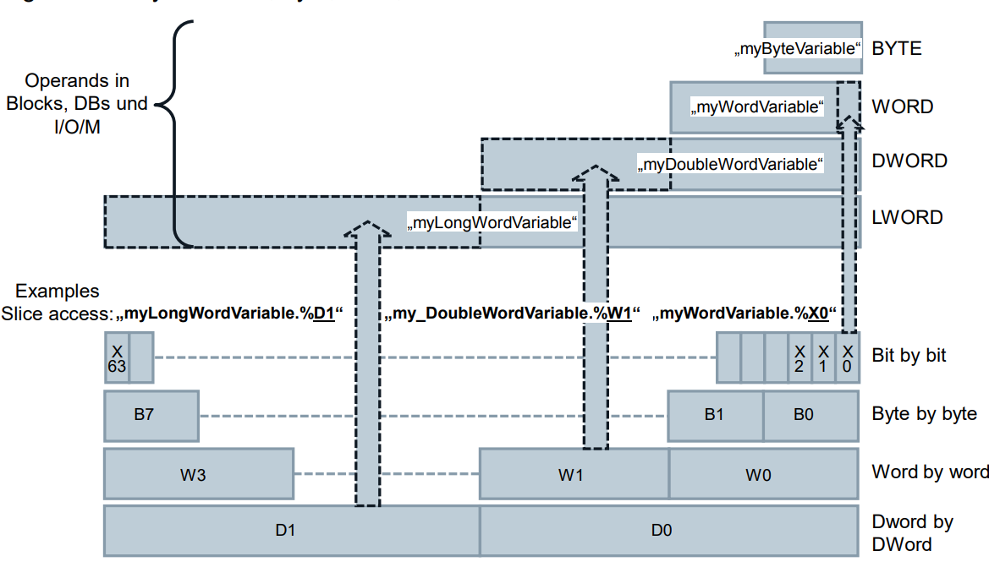<figcaption></figcaption></figure>

<figure>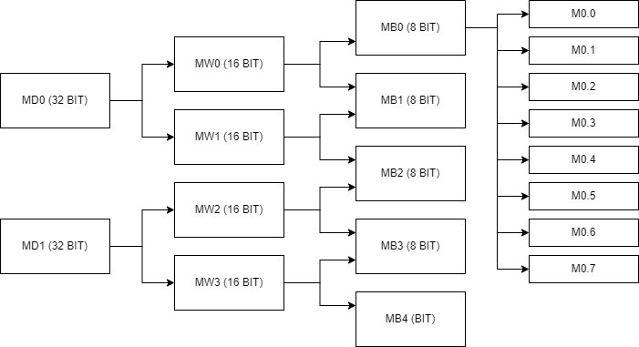<figcaption></figcaption></figure>

#### Использование памяти в программировании

Самый популярный тип памяти - это битовая память, в которой можно хранить 1 или 0. Битовая память, например с адресом M0.0 подключается в языке LAD как выход, чтобы можно было отправлять ей команды. Всего существует основные 3 команды на LAD для такой памяти:

**N (as long as set)** - пока установлен входящий сигнал TRUE (1) держать выход (памяти) в виде TRUE (1)

**S (set)** - установить TRUE (1) на память при подачи сигнала. При этом после потери сигнала память установлена как TRUE (1)

**R (reset)** - сбросить значение памяти, в случае битовой памяти значение сброситься на FALSE или просто 0


Выходами контроллера (Qx.x) можно так же оперировать как и с битовой памятью.


<figure>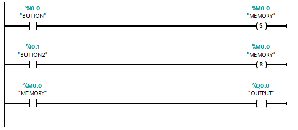<figcaption></figcaption></figure>

> **Программа на картинке выше работает так:** при замыкании нормально открытого контакта I0.0 отправляется сигнал set на память M0.0 . С командой set память M0.0 запоминает сигнал и не пропадет, если разомкнуть контакт I0.0. Так как значение битовой памяти M0.0 - 1, то его нормально открытый контакт замыкается и сигнал идет до выхода Q0.0. Память M0.0 будет удерживать сигнал для Q0.0 до тех пор, пока не будет замкнут контакт I0.1, который отправляет сигнал reset на M0.0, меняя значение этой памяти на 0.

#### Пример использования памяти

**Пример 1:** использование памяти для переключение состояния выхода

Следующая программа на SCL позволяет использовать входной сигнал BUTTON как переключатель. С каждым включением BUTTON мы меняем состояние OUTPUT с 0 на 1, и с 1 на 0:

```cpp
IF "BUTTON" AND NOT "BUTTON_BEFORE@ THEN
    "OUTPUT" := NOT "OUTPUT"; //С каждым разом меняем значение выхода на противоположное значение
END_IF;

//BUTTON_BEFORE - это бит памяти, куда мы записываем текущее состояние BUTTON
"BUTTON_BEFORE" := "BUTTON";
```

<figure>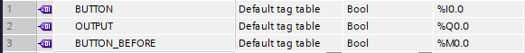<figcaption><p>Таблица PLC tags</p></figcaption></figure>
