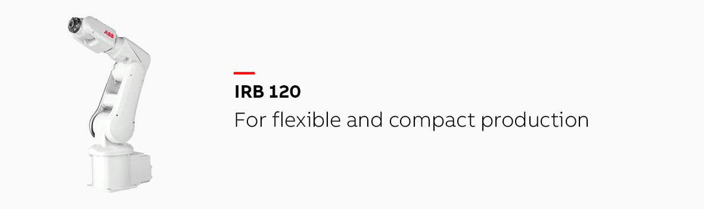

# ABB роботы

Основная специализация роботов компании ABB это различные производства, заводы, склады. Их роботов можно встретить практически на любом автоматизированном заводе.&#x20;

### Виды ABB роботов

* 6-ти звеньевые роботы (включая коллаборативный робот)

* DELTA робот
* SCARA робот
* Покрасочные роботы
