# Гайд по RobotStudio



Полная документация как пользоваться RobotStudio доступна на сайте компании ABB: [перейти к документации](https://search.abb.com/library/Download.aspx?DocumentID=3HAC032104-001\&LanguageCode=en\&DocumentPartId=\&Action=Launch)


Здесь же мы рассмотрим только самые базовые аспекты

### Первые шаги <a href="#first-steps" id="first-steps"></a>


В рамках этого урока мы рассмотрим все основные аспекты программы RobotStudio. Мы создадим робота, попробуем поуправлять им с помощью пульта управления Flex Pendant, добавить инструмент для робота и добавим пару объектов


Для начала запустите программу RobotStudio после чего выберите пункт Solution with Station and Robot Controller. В Solution name пишем название своего первого проекта


Обратите внимание, что путь к папке в Location не должен быть очень длинным, иначе RobotStudio начнем вам выдавать ошибки.&#x20;

Как исправить? Укоротите ссылку. Я делал через CMD консоль с помощью команды ниже:


```
mklink /d c:\<короткий путь> c:\<длинный путь>

Пример: mklink /d "C:\Папка0" "C:\Папка\Папка 2\Папка 3\ Папка 4\Папка 5"
Результат: в данном примере перейдя по пути C:\Папка0, мы окажемся в папке C:\Папка\Папка 2\Папка 3\ Папка 4\Папка 5.
```


Обратите что в окне Controller тоже есть путь Location где нужно, при необходимости, тоже изменить путь


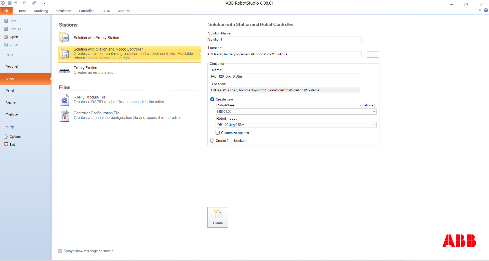

Выбираем необходимую нам версию RobotWare (в моем случае 6.08.01.00) и выбираем робота, который нам необходим. Если вы не знаете что за робот за названием, то обратитесь к каталогу роботов ABB чтобы увидеть "как выглядит" робот


RobotWare - операционная система, которая используется в контроллерах для управления роботом

В данной документации мы будем рассматривать в основном 6 версию RobotWare. Наш выбор связан с тем, что наши роботы не могут работать с более старшей версией. ABB внедряют поддержку в старые модели роботов новую версию RobotWare, однако она не всегда появляется так быстро в самом RobotStudio и чаще всего саму программу приходится обновлять отдельно


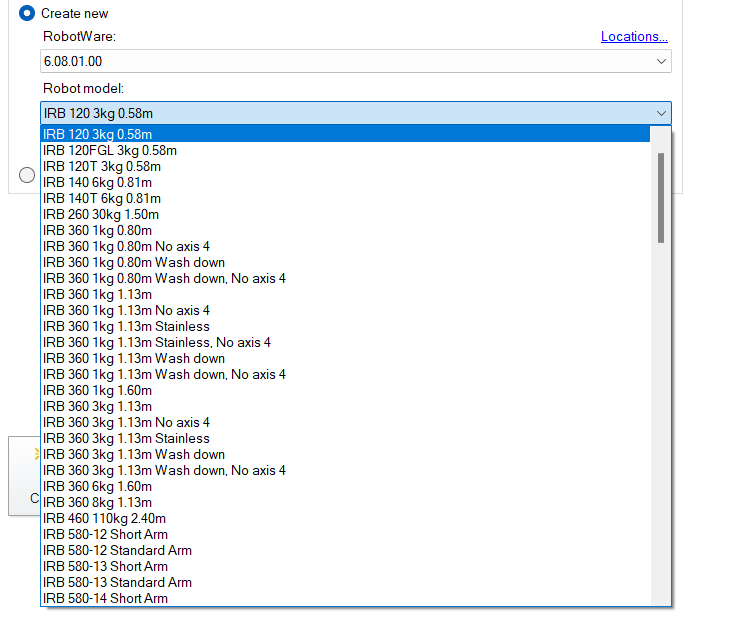

Может случиться, что нужно будет установить RobotWare необходимой версии вручную (хотя как правило в новых версиях RobotStudio он уже предустановлен)

Добавить необходимую версию RobotWare можно перейдя во вкладку Add-ins и найти в галерее RobotWare, затем выбираем необходимую версию и нажимаем Add.

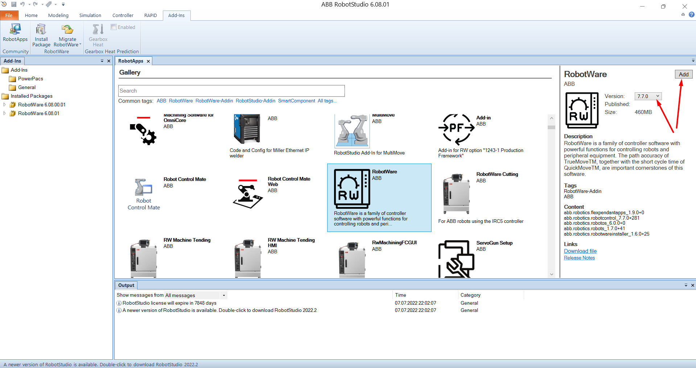

> Далее мы будем работать с роботом IRB120

### Создаем робота <a href="#create-robot" id="create-robot"></a>

После того, как предварительная настройка завершена мы можем создать нашего первого робота нажав иконку CreateПодождав, пока загрузиться программа у нас появляется окно выбора типа робота. Хотим мы использовать IRB120 или IRB120T. Здесь, чтобы понимать какого робота мы точно хотим нужно всегда обращаться к технической документации ABB.Техническая документация на робота серии IRB120 доступна здесь: [перейти на страницу](https://library.e.abb.com/public/4ba04345ce481405482579800011cbfa/Product%20presentation%20IRB%20120%20Revision%20E.pdf)​

> Спойлер: разница между ними в скорости и в углах поворота (IRB120T лучше в этом плане)\
>

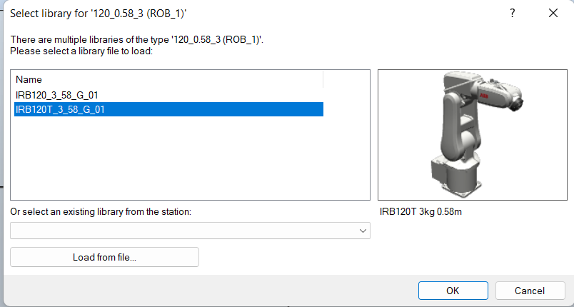

На данный момент для нас нет разницы какого робота мы будем использовать, так как мы не будем подключать нашу первую программу к настоящему роботу

### Управление интерфейсом RobotStudio <a href="#robotstudio-interface" id="robotstudio-interface"></a>

Чтобы перемещаться по созданной площадке используйте комбинацию Ctrl + левая кнопки мыши

Чтобы поворачиваться в пространстве созданной площадки используйте комбинацию Alt + Ctrl + левая кнопка мыши

Колесиком мыши можно увеличивать или уменьшать расстояние до объектов

Чтобы отменить последнее действие используйте Ctrl + Z

Чтобы сделать сохранение используйте Ctrl + S

### **Движение робота** <a href="#robot-moving" id="robot-moving"></a>

Чтобы начать двигать робота необходимо выбрать в окне Home категорию Freehand и выбрать необходимое нам движение (линейное или круговое) и кликнуть на робота, чтобы появились координатные стрелки

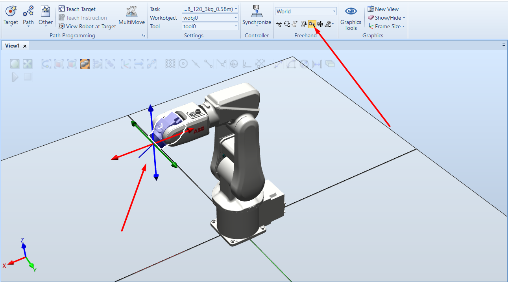

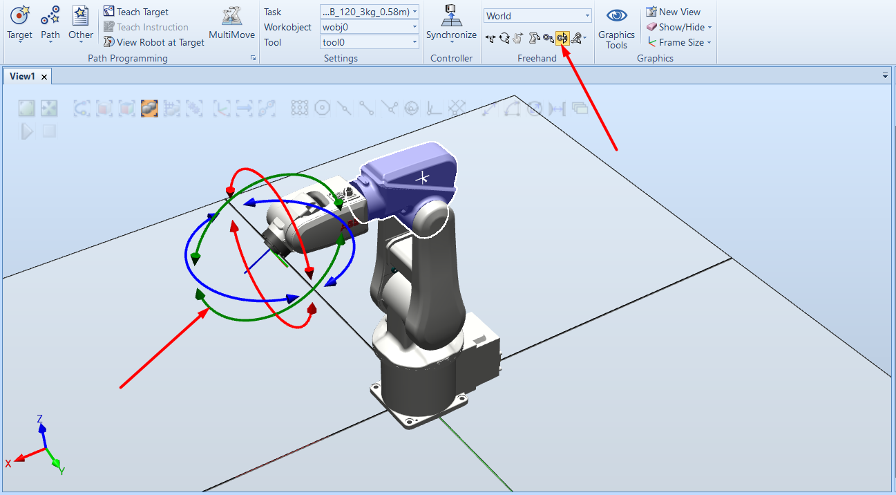

Есть возможность в RobotStudio отдельно каждое звено поворачивать по оси в градусах


При необходимости робота можно вернуть обратно на свою изначальную позицию с помощью команды Jump Home во вкладке Layout (в правой боковой панели)

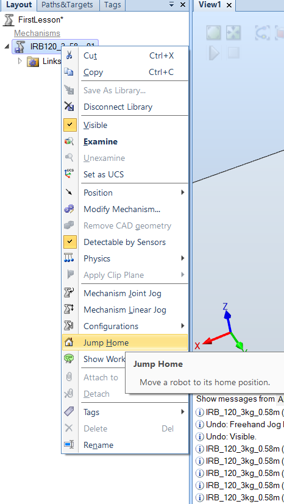

**Mechanism Joing Jog -** возможность двигать робота по круговой оси

**Mechanism Linear Jog -** возможность двигать робота по линейной оси

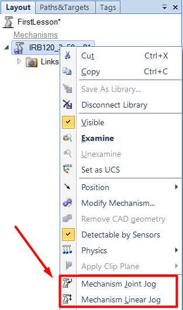

### **Управление с помощью FlexPendant** <a href="#flex-pendant" id="flex-pendant"></a>

Чтобы запустить Flex Pendant необходимо перейти во вкладку Controller и выбрать там FlexPendant -> Virtual FlexPendant

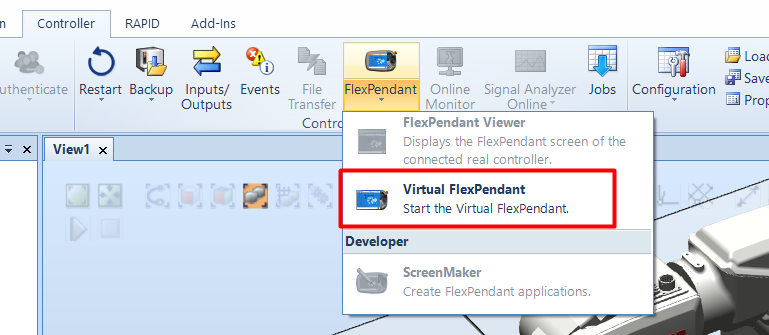

Далее перед вами появится сам пуль управления FlexPendant. Обратите внимание, что это окно независимое и может располагаться где угодно. Например на втором мониторе, чтобы не мешал дальше работать в RobotStudio

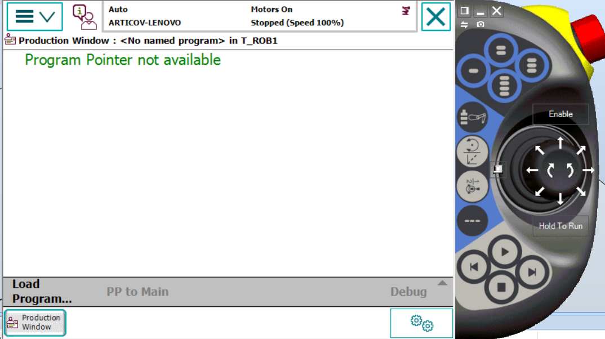

Чтобы начать управление роботом через пульт управления необходимо открыть меню и выбрать пункт "Jogging"

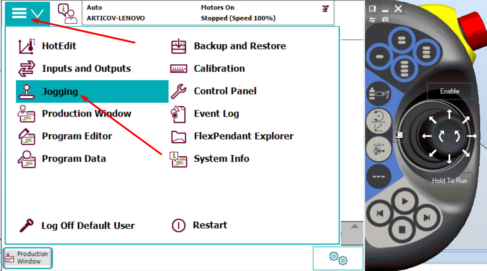


FlexPendant в точности копирует настоящий пульт управления, поэтому прежде чем что-то двигать необходимо перевести пульт управления в режим "ручного управления"


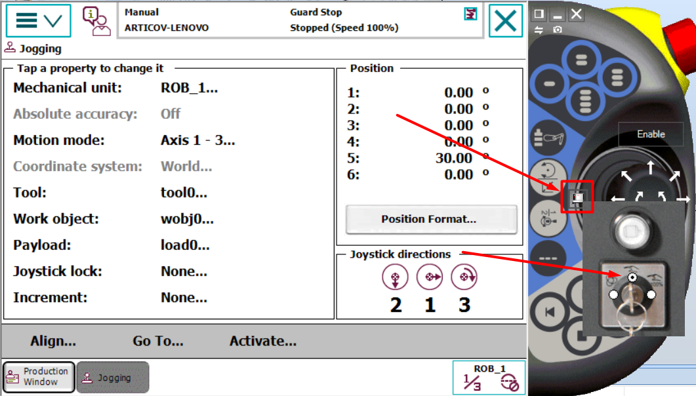

Затем нужно включить сами сервоприводы нажав на кнопку "Enable" и "Hold To Run", последнее действие не всегда обязательно. Попробуйте подвигать робота

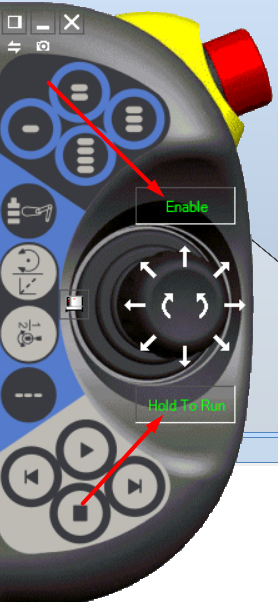

С помощью функции Motion Mode мы можем выбирать какими степенями свободы мы хотим управлять. Нажав на ROB\_1 снизу вы можете выбрать какие параметры вы хотите изменить или добавить

> ROB\_1 - индексация робота в RobotWare. Её можно изменить, но лучше этого не делать

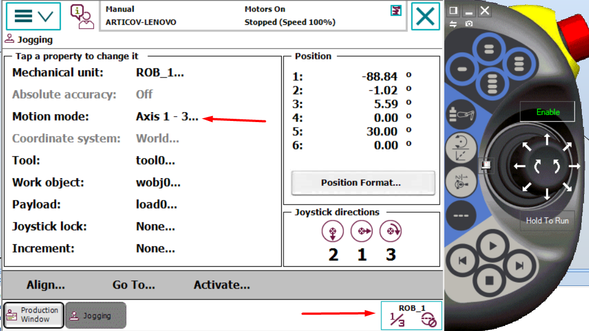

1. Выбор управления степенями свободы (как Motion Mode), выбор рабочего инструмента и выбор рабочего объекта
2. Задать определенную угловую скорость (например 1 градус за поворот)
3. Режим работы - о них поговорим позже
4. Режим шага - о них поговорим позже
5. Выбор скорости для сервоприводов
6. Выбор робота, с которым хотим работать (по умолчанию ROB\_1, если несколько роботов, то можно выбрать одного или всех сразу)

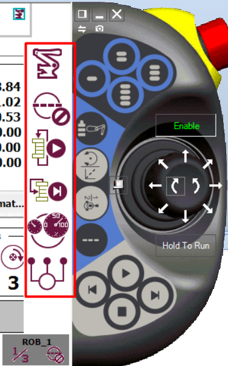



В этом видеоролике можно увидеть как управлять роботом с помощью различных функций движений робота описанных выше. [Видео](https://www.youtube.com/watch?v=TbghCJJ8eQg)

Попробуйте каждую функцию и сделайте для себя выводы (с чем удобнее работать, как это происходит)



При управлении роботом вы можете столкнуться с достаточно частой проблемой - robot is out of working range, что означает что робот находится вне зоны действия&#x20;


В этом случае необходимо нажать на кнопку Acknowledge и попробовать двигать робота по другому. Так как звенья робота не способны двигаться в 1 сторону 360 градусов.&#x20;

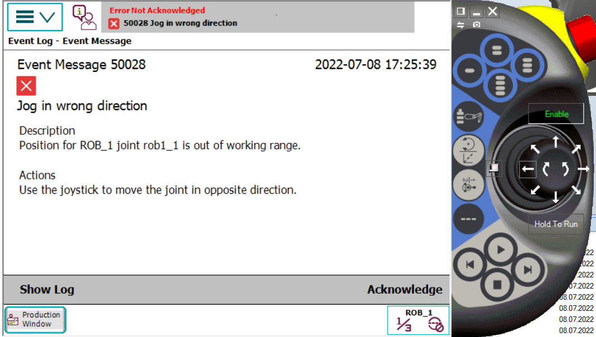

### Добавление рабочего инструмента <a href="#add-tool" id="add-tool"></a>

Чтобы добавить рабочий инструмент перейдите во вкладу Home -> Import Library -> Equipment затем найдите необходимый вам рабочий инструмент, например ручка.

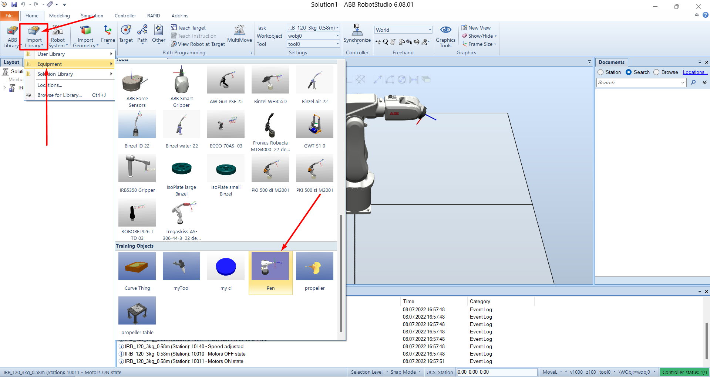

После добавления сам инструмент появится на координатной плоскости и будет "внутри" нашего робота. Чтобы его зацепить на необходимое место, его нужно взять и перенести на нашего робота (IRB120 3 50 01)

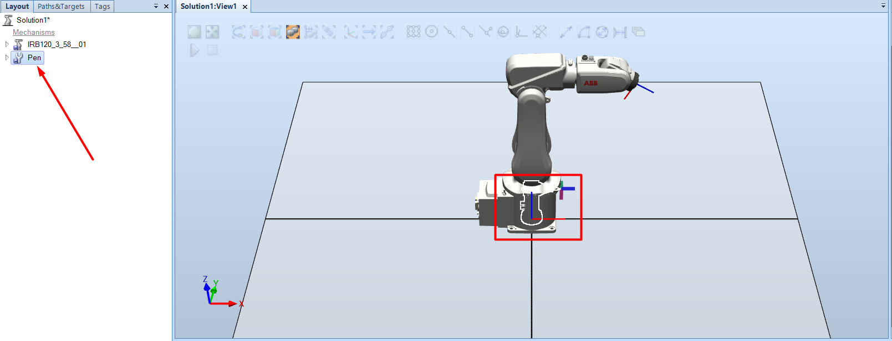

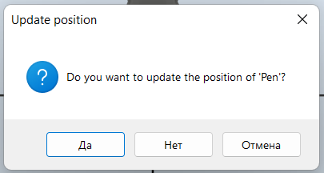

После зацепления и переноса рабочего инструмента в нашего робота вы увидите, что инструмент отображается в нужно месте и дополнительно можно проверить правильность настроек перейдя во вкладку Path & Targets и открыть древо IRB -> T\_ROB1 -> Tooldata и там мы увидим "дефолтный инструмент" tool0 и наш добавленный Pen\_TCP

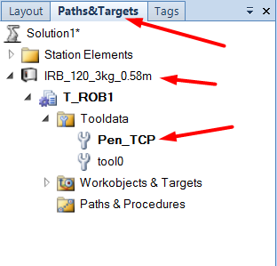



С помощью библиотеки можно добавлять различные модели, вплоть до полноценных заводов и все это симулировать и автоматизировать


### Учим пункты для робота <a href="#teach-point" id="teach-point"></a>

Пунктам робота можно обучить 3 способами:
